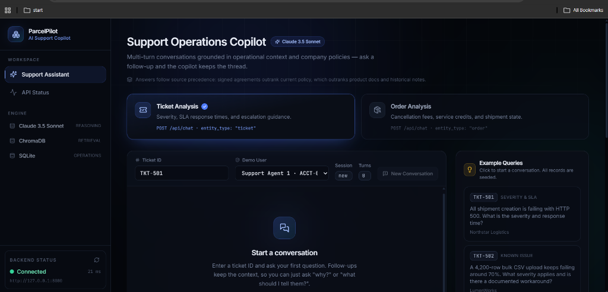
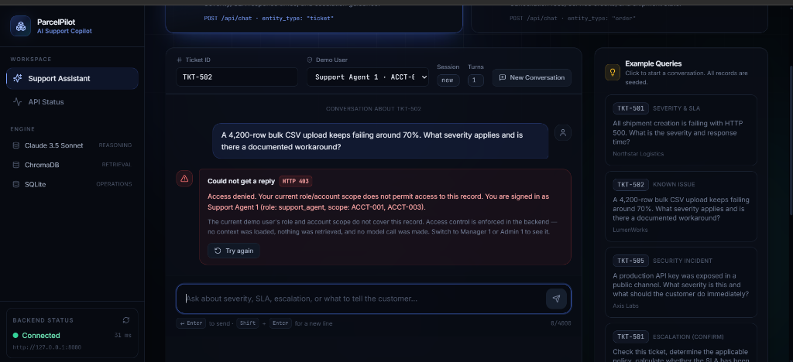
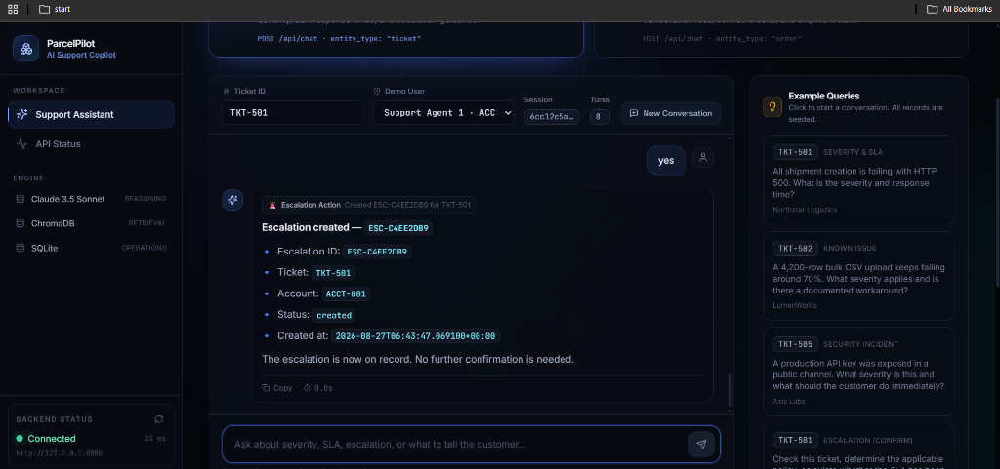

# ParcelPilot AI Support Copilot

> A production-style AI support operations system — multi-turn conversations, RAG-grounded answers, and backend-enforced access control, deployed on Vercel and Render.

[](https://python.org)
[](https://fastapi.tiangolo.com)
[](https://react.dev)
[](https://www.typescriptlang.org)
[](https://www.trychroma.com)
[](LICENSE)

[](https://parcelpilot-ai-agent-psi.vercel.app/)
[](https://parcelpilot-ai-agent-59d5.onrender.com/)
[](https://parcelpilot-ai-agent-59d5.onrender.com/health)

---

## Overview

**ParcelPilot AI Support Copilot** is an AI-powered support operations tool built to help customer support agents resolve tickets and orders faster. Instead of searching through policy documents or escalation procedures manually, agents ask natural language questions and receive context-aware, grounded answers based on the operational record, company documents, and conversation history.

This is not a generic chatbot. It is a purpose-built support operations copilot with:

- **Multi-turn conversational memory** — follow-ups like "why?" or "what should I tell the customer?" maintain context.
- **Retrieval-Augmented Generation** — answers are grounded in ChromaDB-retrieved knowledge before the LLM is invoked.
- **Backend-enforced authorization** — role-based access control prevents account data from leaking across agent scopes, even if the client supplies an arbitrary record ID.
- **Escalation workflow** — agents can escalate tickets through the conversation interface, with the action confirmed explicitly before execution.

---

## Application Preview

### Support Operations Dashboard



The main workspace. Agents select a **Ticket ID** or **Order ID**, choose an authenticated demo user, and start a conversation. The right panel surfaces one-click example queries seeded from real records in the database — no setup needed to see it working.

The sidebar shows the active inference stack:
- **Claude 3.5 Sonnet** — reasoning engine
- **ChromaDB** — vector retrieval
- **SQLite** — operational data

The backend connection status (latency, URL) is shown live at the bottom left.

---

### Backend-Enforced Authorization Failure (HTTP 403)



**Support Agent 1** (scope: `ACCT-001`, `ACCT-003`) attempts to query **TKT-502**, a ticket belonging to an account outside their permitted scope.

The backend returns **HTTP 403** before loading any record context, before vector retrieval, and before the LLM is called. The error message names the caller's own role and scope — not the record's owner — so no account information is disclosed in the denial.

This means modifying a ticket ID in the browser cannot widen access. Authorization is a server-side property of the record's owning account, not of the client request.

---

### Escalation Confirmed



A confirmed escalation for **TKT-501**. The UI displays the complete escalation record inline:

| Field | Value |
|---|---|
| Escalation ID | `ESC-C4EE2DB9` |
| Ticket | `TKT-501` |
| Account | `ACCT-001` |
| Status | `created` |
| Created at | `2026-08-27T06:43:47.069100+00:00` |

Escalations follow a two-step flow: the AI prepares and justifies the action on the first turn, and execution only happens after explicit confirmation. The UI confirms that no further action is required.

---

## Architecture

```
┌─────────────────────────────────────────────────────────┐
│                     React / Vite Frontend               │
│          TypeScript  ·  Vite proxy  ·  Vercel           │
└─────────────────────┬───────────────────────────────────┘
                      │ HTTP  (X-User-ID header)
┌─────────────────────▼───────────────────────────────────┐
│                    FastAPI Backend                       │
│                                                         │
│  ┌───────────────┐  ┌──────────────┐  ┌─────────────┐  │
│  │ Access Control│  │ Chat Service │  │ Agent (RAG) │  │
│  │ authenticate()│  │ send_message │  │  _generate  │  │
│  │ authorise()   │  │ session store│  │  _answer    │  │
│  └───────┬───────┘  └──────┬───────┘  └──────┬──────┘  │
│          │                 │                  │         │
│  ┌───────▼─────────────────▼──────────────────▼──────┐  │
│  │  SQLite (tickets, orders, accounts)               │  │
│  │  ChromaDB (policy docs, SOPs, agreements)         │  │
│  │  Agent Router → Claude 3.5 Sonnet                 │  │
│  └───────────────────────────────────────────────────┘  │
└─────────────────────────────────────────────────────────┘
```

### Stack

| Layer | Technology |
|---|---|
| Frontend | React 18, TypeScript, Vite |
| Backend | Python, FastAPI, Uvicorn |
| AI / LLM | Claude 3.5 Sonnet via Agent Router (OpenAI-compatible client) |
| Retrieval | ChromaDB, Retrieval-Augmented Generation |
| Operational data | SQLite |
| Access control | Mocked role-based access control (demo) |
| Frontend deployment | Vercel |
| Backend deployment | Render |

---

## Features

### Multi-Turn Conversations

The `POST /api/chat` endpoint maintains session state across turns. A support agent can ask a follow-up question like *"Should this be escalated?"* and the model resolves it against the same ticket context and conversation history from the preceding turns. Retrieval runs on every turn against the current message, not just the first.

### Retrieval-Augmented Generation

Before any LLM call, ChromaDB retrieves the most relevant chunks from the company knowledge base. Source precedence is enforced in the prompt:

1. Customer-signed agreements
2. Current company policy / SOPs
3. Product documentation
4. Historical notes

Lower-priority historical information cannot override a signed agreement or active policy.

### Role-Based, Account-Scoped Authorization

Three demo roles are configured:

| Role | Account Scope |
|---|---|
| `support_agent` | Specific accounts only (e.g., `ACCT-001`, `ACCT-003`) |
| `manager` | All accounts |
| `admin` | All accounts |

The caller is identified by the `X-User-ID` request header. The record's owning account is resolved from the database — not from the request — and checked against the user's allowed accounts. An unrecognised user ID returns HTTP 401; a record outside the caller's scope returns HTTP 403. Both happen before any protected context is loaded.

### Escalation Workflow

Escalation requests follow a prepare-then-confirm pattern. The AI investigates the ticket, applies the relevant policy, and asks for explicit confirmation before the escalation record is created. Confirmation can only happen within the same session that prepared the action.

### Automatic Database Initialization

On startup, the backend checks whether the `tickets` table exists in the SQLite database. If not — as happens on a fresh Render deployment — it runs the seed script automatically. Records like `TKT-501`, `TKT-502`, and `ORD-1001` are available immediately without any manual step.

---

## API Reference

| Method | Endpoint | Description |
|---|---|---|
| `GET` | `/health` | Returns service status, provider, and active model name. |
| `GET` | `/` | Confirms the API is reachable. |
| `POST` | `/api/chat` | Multi-turn conversational endpoint. Accepts entity type, entity ID, message, and optional session ID. Enforces authorization before any data is loaded. |
| `POST` | `/api/tickets/{ticket_id}/answer` | Single-turn question about a ticket. No session state retained. |
| `POST` | `/api/orders/{order_id}/answer` | Single-turn question about an order. No session state retained. |

**Health response example:**

```json
{
  "status": "ok",
  "service": "ParcelPilot AI Support Copilot",
  "provider": "Agent Router",
  "model": "claude-3-5-sonnet-20241022"
}
```

**Chat request example:**

```json
{
  "entity_type": "ticket",
  "entity_id": "TKT-501",
  "message": "What severity applies and what is the SLA response target?",
  "session_id": "6cc12c5a..."
}
```

---

## Live Demo

| Service | Live URL |
|---|---|
| **Frontend Application** | [Open ParcelPilot AI Support Copilot](https://parcelpilot-ai-agent-psi.vercel.app/) |
| **FastAPI Backend** | [Open Backend API](https://parcelpilot-ai-agent-59d5.onrender.com/) |
| **API Health Check** | [Check API Health](https://parcelpilot-ai-agent-59d5.onrender.com/health) |

- **Frontend** — React + TypeScript + Vite application deployed on Vercel.
- **Backend API** — FastAPI service deployed on Render.
- **Health Check** — Returns the current backend status, service information, provider, and configured model.

> The demo includes seeded records. Use the one-click example queries in the UI to see the system working immediately without any configuration.

---

## Local Setup

### Prerequisites

- Python 3.11+
- Node.js 18+
- npm

### Backend

```bash
git clone <repository-url>
cd parcelpilot-ai

python -m venv .venv

# Windows
.venv\Scripts\activate

# macOS / Linux
source .venv/bin/activate

pip install -r requirements.txt
```

Create a `.env` file at the project root:

```ini
# Required
AGENT_ROUTER_API_KEY=your_agent_router_api_key_here
AGENT_ROUTER_BASE_URL=https://agentrouter.org/v1

# Optional — defaults to claude-3-5-sonnet-20241022 if not set
CLAUDE_MODEL=claude-3-5-sonnet-20241022

# Optional — required when the frontend calls the backend directly (not via Vite proxy)
CORS_ALLOW_ORIGINS=http://localhost:5173
```

Start the backend:

```bash
uvicorn app.main:app --reload
```

The database is initialized automatically on first startup. No manual seed step is required.

### Frontend

```bash
cd frontend
npm install
npm run dev
```

**Frontend environment variables** (for production builds):

```ini
# Base URL of the FastAPI backend, used when calling the API directly from the browser
VITE_API_BASE_URL=https://your-backend.onrender.com

# Set to true to bypass the Vite proxy and call the backend URL above directly
VITE_API_DIRECT=true
```

In local development, the Vite dev server proxies `/api` and `/health` to the backend — `VITE_API_DIRECT` is not needed. In a deployed frontend (e.g., Vercel), set `VITE_API_DIRECT=true` and configure `CORS_ALLOW_ORIGINS` on the backend to include the deployed frontend origin.

---

## Security and Access Control

> **Note:** Authentication and user identities are mocked for demonstration purposes. `X-User-ID` is not a production authentication mechanism.

Authorization logic is enforced entirely on the server:

- The **frontend never decides** which accounts a user may access.
- The `X-User-ID` header is used only to look up the caller in the server-side demo directory.
- The **record's owning account** is resolved from the database, not from anything the client sends.
- The user's allowed account set is checked before any of the following occur:
  - Loading protected record context
  - Vector retrieval from ChromaDB
  - Any LLM call

An agent who modifies a ticket ID in the browser to a record outside their scope receives HTTP 403. No record data, retrieved chunks, or model tokens are consumed.

---

## Project Structure

```
parcelpilot-ai/
├── app/
│   ├── agent/          # RAG pipeline, prompt assembly, LLM calls
│   ├── config/         # Demo user directory (roles, account scopes)
│   ├── database/       # SQLite connection factory
│   ├── models/         # Pydantic request/response models
│   ├── services/       # Access control, chat orchestration, session store
│   ├── errors.py       # Domain exception types
│   └── main.py         # FastAPI app, startup hook, error handlers, routes
│
├── scripts/
│   └── ingest_excel.py # Seeds accounts, orders, and tickets from the source spreadsheet
│
├── storage/
│   └── sqlite/         # SQLite database (auto-created on startup if absent)
│
├── tests/              # pytest test suite
│
├── frontend/           # React + TypeScript + Vite application
│
└── docs/
    └── images/         # Screenshots used in this README
```

---

## Testing

```bash
pytest -q
```

Access-control behavior is explicitly tested. A representative scenario:

> A `support_agent` user with scope `ACCT-001, ACCT-003` requests data for a ticket belonging to `ACCT-004`. The backend returns HTTP 403. No record is loaded, no retrieval occurs, and no model call is made.

---

## Design Goals

This project was built to demonstrate engineering practices relevant to AI-integrated backend systems:

| Area | Implementation |
|---|---|
| Production-style FastAPI architecture | Layered services, domain exceptions, narrow error mapping |
| RAG pipeline | ChromaDB retrieval, source precedence, per-turn retrieval |
| Multi-turn conversations | Session store, history windowing, follow-up resolution |
| Backend authorization | Pre-retrieval access control, server-side account resolution |
| LLM integration | Agent Router, OpenAI-compatible client, retry logic |
| Database initialization | Automatic seed on first startup for fresh deployments |
| Frontend-backend integration | Vite proxy (dev) + configurable direct API URL (prod) |
| Deployment | Vercel (frontend), Render (backend) |

---

## Future Improvements

The following are areas for genuine improvement — none of these are implemented yet:

- **Real authentication** — replace the `X-User-ID` mock with an identity provider (OAuth2, JWT).
- **Persistent session storage** — move conversation sessions from in-memory to Redis or a database so sessions survive restarts.
- **Streaming responses** — stream LLM tokens to the frontend for a faster perceived response time.
- **Persistent vector store** — host ChromaDB on a managed service rather than the local filesystem so embeddings survive Render redeploys.
- **Production database** — PostgreSQL with a proper migration tool for operational data.
- **Observability** — structured logging, distributed tracing, and latency instrumentation across the RAG pipeline.
- **Background jobs** — asynchronous document ingestion and re-indexing without blocking the API.

---

## License

MIT
